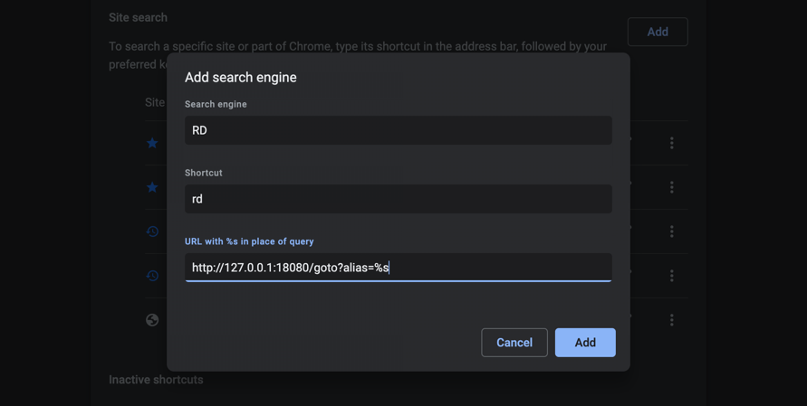
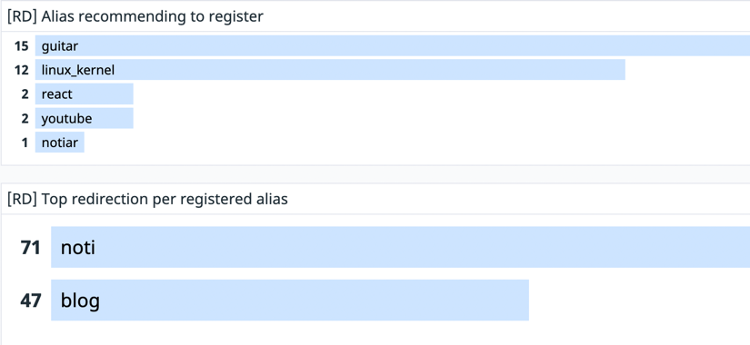

# rd

rd is a simple personal redirection server.

You can set aliases for destinations that you want to be redirected in a very convenient way!

Try setting aliases of the urls where your everyday and be free from using a mouse.

## Use cases (To be updated)

## Getting Started

If you are hesitating to use rd, just try it with CLI. You don't have to use browsers always.

```shell
# start running rd
docker run --rm -p 18080:18080 umi0410/rd
```

```shell
# open a new terminal and try alias "rd" to be redirect to README.md of rd.
curl -sL localhost:18080/goto?alias=rd | head -n 3
```

## How to use

* [chrome](#Chrome)

### Chrome

1. Visit [chrome://settings/searchEngines](chrome://settings/searchEngines).
2. Add your rd server as a new search engine.
  
3. In your site search list, Please click `...` button of the rd server and set it as the default search engine.
4. 🎉 Please open a new tab and enjoy rd.

Don't worry about not using Google as the default search console. rd will try Google as a fallback when
there is no matching alias you input.

## Development

The initial structure of the project was written by [cobra-cli](https://github.com/spf13/cobra-cli/).

```shell
# Setup cobra-cli
export GOPATH=${HOME}/go
go install github.com/spf13/cobra-cli@latest
echo "author: Jinsu Park <dev.umijs@gmail.com>
license: apache
useViper: true" > ~/.cobra.yaml
```

```shell
# Initiate the project
cobra-cli init
cobra-cli add create
cobra-cli add delete
cobra-cli add list
cobra-cli add reload
cobra-cli add run 
```

You can use rd with docker with the following commands.

```shell
docker build . -t umi0410/rd
docker run --rm -p 18080:18080 -v ${HOME}/.config/rd/local.yaml:/app/config/local.yaml \
  -e RD_CONFIG_NAME=local \
  umi0410/rd run
```

If you decided to use rd, please run rd with the following commands to run it always.

```shell
docker run --name rd -p 18080:18080 -v ${HOME}/.config/rd/local.yaml:/app/config/local.yaml \
  -e RD_CONFIG_NAME=local \
  -d --restart=always \
  umi0410/rd run
```

## Statistics



```shell
$ curl http://localhost:18090/metrics -s | grep rd_redirection
# HELP rd_redirection_count The total number of redirections.
# TYPE rd_redirection_count counter
rd_redirection_count{alias="blog",destination="https://umi0410.github.io"} 18
# if destionation is empty, it means the alias is not registered
# and forwarded to Google search.
rd_redirection_count{alias="guitar",destination=""} 33
...
```

You can export OpenMetrics about redirections by rd and of course, can connect them 
with DataDog and other monitoring tools.

Later, it might be automated to register aliases which you frequently use but not registered.

### How to collect statistics

```shell
# Run a datadog-agent to collect metrics from your rd server
docker run --cgroupns host --pid host \
--rm --name dd-agent \
-v /var/run/docker.sock:/var/run/docker.sock:ro \
-v /proc/:/host/proc/:ro \
-v /sys/fs/cgroup/:/host/sys/fs/cgroup:ro  \
-e DD_API_KEY=<<REPLACE THIS WITH YOUR API KEY>> \
-e DD_SITE=datadoghq.com \
gcr.io/datadoghq/agent:latest
```

```shell
docker run --rm --name rd -p 18080:18080 -p 18090:18090 \
  -v ${HOME}/.config/rd/local.yaml:/app/config/local.yaml \
  -e RD_CONFIG_NAME=local \
  -l com.datadoghq.ad.check_names='["openmetrics"]' \
  -l com.datadoghq.ad.init_configs='[{}]' \
  -l com.datadoghq.ad.instances='[{"openmetrics_endpoint":"http://%%host%%:%%port%%/metrics","metrics":[{"rd_redirection_count":"rd_redirection_count"}]}]' \
  umi0410/rd run
```

Documentation from datadog: https://docs.datadoghq.com/containers/docker/prometheus/
